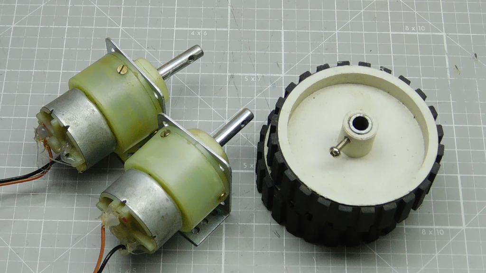
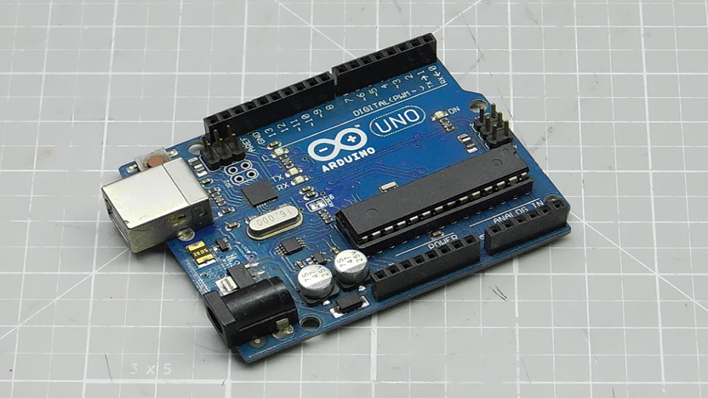
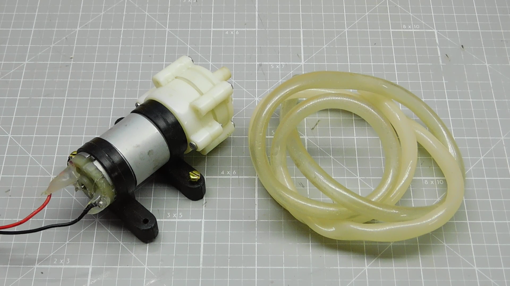
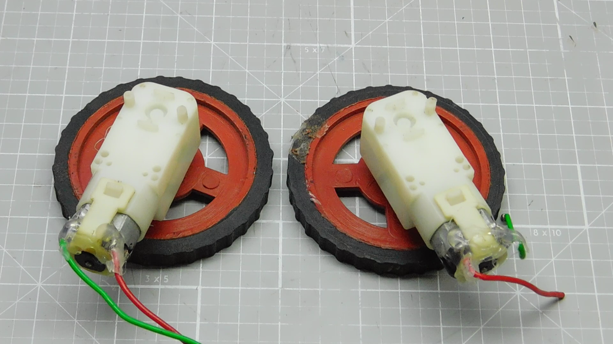
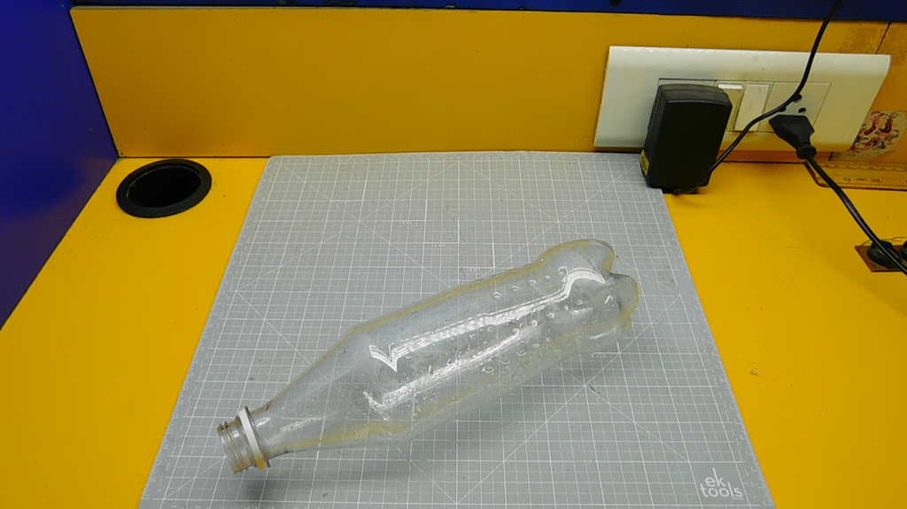
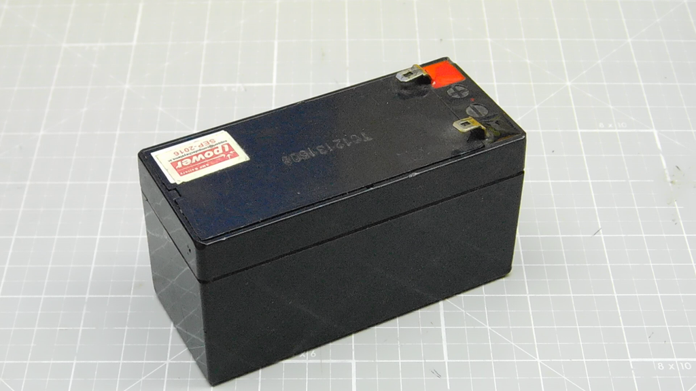
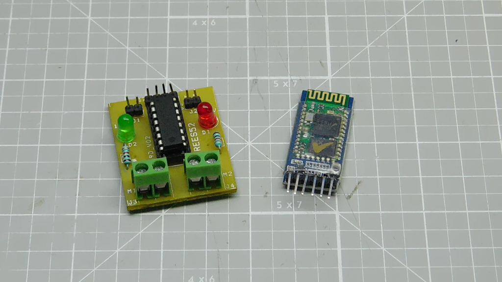
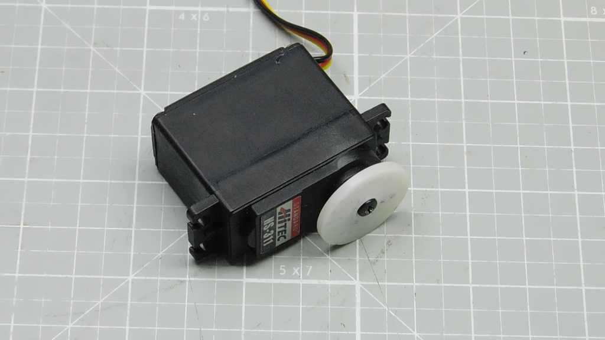

# Mr Wiper

Mr Wiper is an Arduino Uno based robot . As the name suggested, it's floor cleaner machine, that can be used to clean the floor very easily and helps to less the hard labour to a great extent.

 

---
### Necessary Tools

  
   
  
	

 

  
   
  

 

  
   

---

### Connection Diagram
Proteus [Circuit Diagram] & [Arduino Uno] code is added in code section. Here is the rough connection and output is shown below: 

