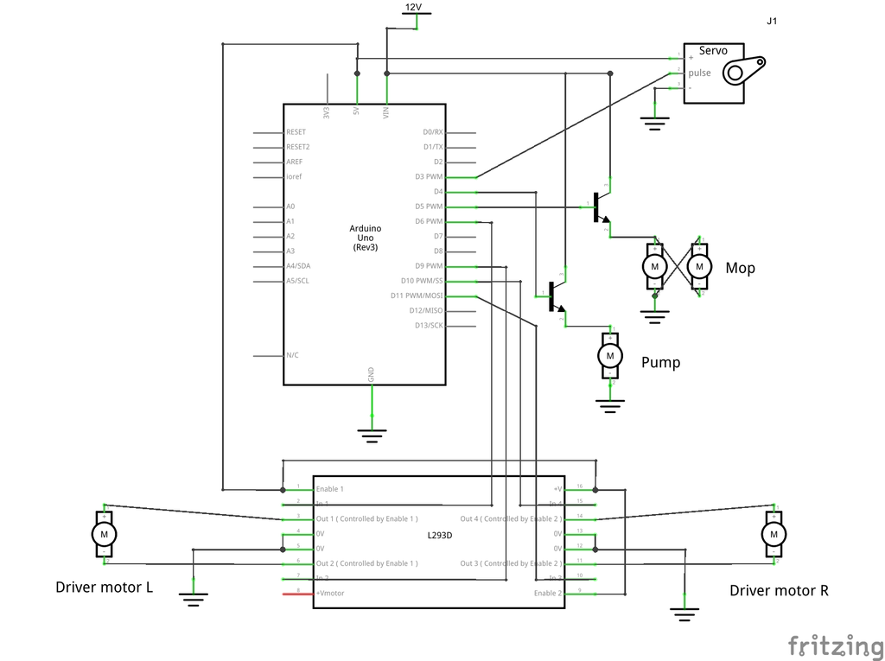
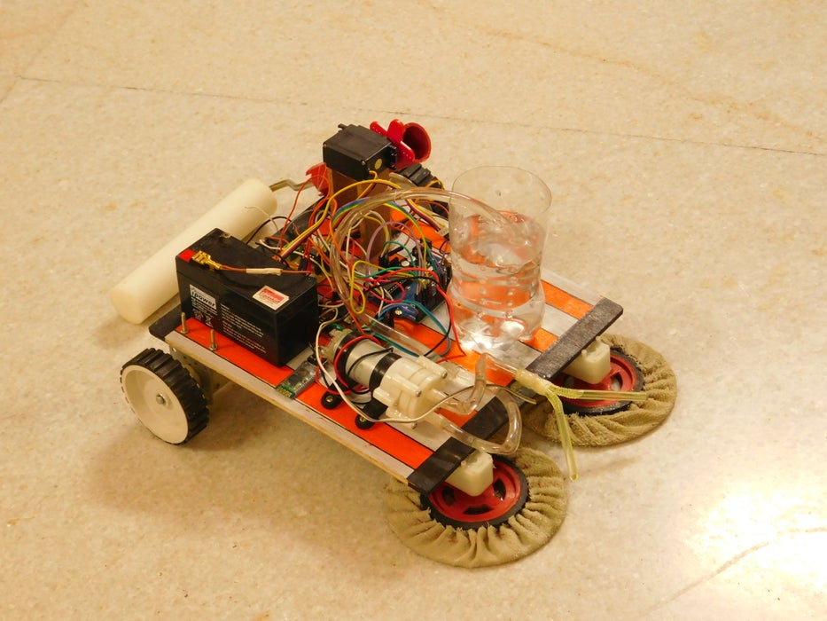

# Mr Wiper

Mr Wiper is an [Arduino Uno][au] based robot . As the name suggested, it's floor cleaner machine, that can be used to clean the floor very easily and help to less the hard labour to a great extent. For controlling the bot [bluetooth controller][bc] has been used.

 

---
### Necessary Tools

  
   
  
	

 

  
   
  

 

  
   

---

### Connection Diagram
Proteus [Circuit Diagram][cd] & [Arduino Uno][au] code is added in code section. Here is the rough connection and output is shown below: 

<table>
  <tr>
    <td>Connection Diagram</td>
     <td>Final Output</td>
  </tr>
  <tr>
    <td></td>
    <td></td>
  </tr>
</table>

---

### Software & Tools Used
[][ai]
[][prot]

[au]: https://github.com/sabbirahmedAUST/Mr_Wiper/23.ino
[cd]: https://github.com/sabbirahmedAUST/Mr_Wiper/MrWiper.pdsprj
[prot]: https://github.com/sabbirahmedAUST/Mr_Wiper/tree/main/image/proteus.jpg
[ai]: https://github.com/sabbirahmedAUST/Mr_Wiper/tree/main/image/arduino.png
[bc]: https://play.google.com/store/apps/details?id=nextprototypes.BTSerialController&hl=en

